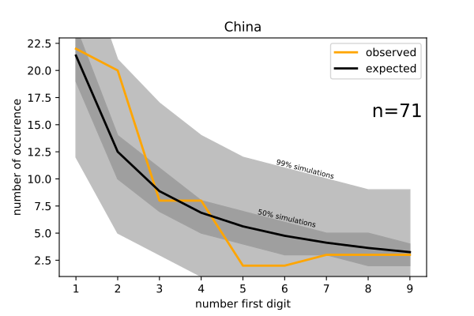

This is in reference to [this reddit post](https://www.reddit.com/r/dataisbeautiful/comments/fo89zr/oc_china_iran_tallies_of_covid19_appear/).

I used data from [ourworldindata.org](https://covid.ourworldindata.org/data/ecdc/full_data.csv), which corresponds to WHO data.
The full pipeline is accessible as a jupyter python notebook.

So, first digits in the number of new cases per day and per country were collected.

The chi-square test was not adapted to test the data for the country of interest, China, because the expected values where <5 in several cases (there is only 74 values for China).

I then tried a simulation approach, drawing in the Benford's distribution a number of digits equal to the values for China (n=74). 
This is the results, using 10000 simulation to have a good approximation of the variance around the Benford's distribution with such low numbers :

So basically, the observed distribution is well within the bound of what can be expected for such a short number. 
There is no reason, based on this data, to suspect data manipulation in the reported number of new cases per day based on the Benford's distribution.

Interestingly, performing the same analysis on the data of the whole world shows that they differ from the Benford distribution.
Similarly, A Kolmogorov-Smirnov test rejects both the whole world count and the China count. 
Although it should be noted that the KS test can sometimes be overly conservative (especially for discrete distributions), I would also question the idea that this data, in general, would follow the Benford's distribution exactly rather than a noisier version of it (due to the nature of the data, the fact that it is often numbers with a single digits, ...)
